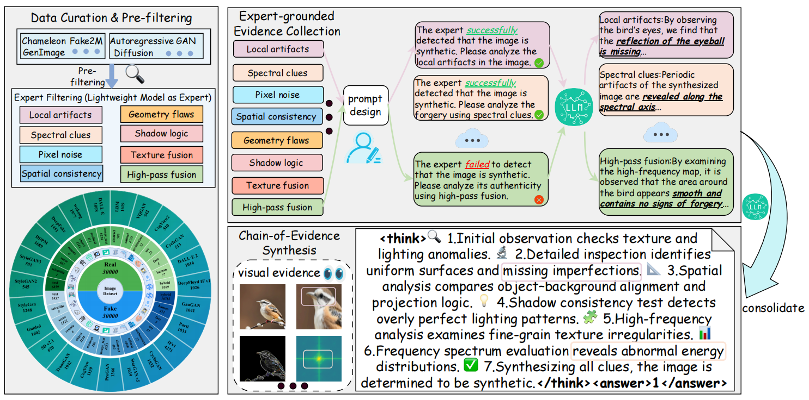
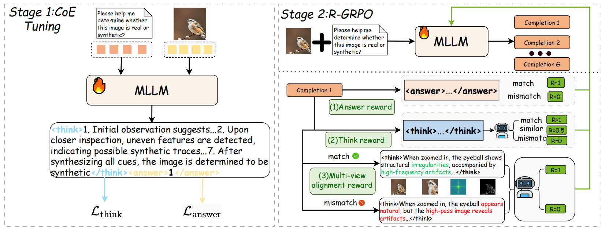

# REVEAL: Reasoning-Enhanced Forensic Evidence Analysis for Explainable AI-Generated Image Detection[ECCV 2026]

[ 📄[**Paper**](https://arxiv.org/abs/2511.23158) | 🔗[**Data**](https://huggingface.co/datasets/sanmu29/REVEAL-Bench) | 🚀[**Model**](https://huggingface.co/sanmu29/REVEAL/tree/main/REVEAL) ]


In this work, we introduce:

> 📍**REVEAL-Bench Dataset**: An explainable AI-generated image detection benchmark featuring multi-view forensic evidence, reasoning traces, and rigorous in-domain and out-of-distribution evaluation protocols.
>
> 📍**REVEAL**: A reasoning-enhanced forensic framework that aggregates multi-view evidence through large vision-language models, achieving strong generalization across unseen generators while providing transparent, human-interpretable decision processes.


## Installation

```bash
conda create -n REVEAL python=3.10
conda activate REVEAL
```

Please follow the official Swift v3.6 installation guide to install the required dependencies:

https://swift.readthedocs.io/en/v3.6/


## 🔥 Training
Download training data [here]([https://www.modelscope.cn/datasets/EricTanh/HydraFake/tree/master/jsons/train](https://huggingface.co/datasets/sanmu29/REVEAL-Bench)).

### 1. supervised fine-tuning on a consolidated Chainof-Evidence dataset (CoE Tuning)
```bash
sh examples/train/liger/sft_llava_13b_single.sh
```

### 2. Reasoning-Enhanced GRPO (R-GRPO)
```bash
sh examples/train/grpo/plugin/grpollava_stepthink13b.sh
```


```


## 🚀 Customize your own detector

We recommend using Veritas-Cold-Start + P-GRPO for further customization:
- Veritas is fine-tuned on in-domain datasets, i.e., the latest generative model is SD-XL. As mentioned in our paper, for practical usage, you can further fine-tune [Veritas-Cold-Start](https://www.modelscope.cn/models/EricTanh/Veritas-Cold-Start) on your own collected data. 
- If you adopt our P-GRPO, the only thing you should prepare is the binary labels of your data. Arrange them similar to our `pgrpo_8k.json`.
- We also encourage the development of (1) novel GRPO-style algorithm, e.g., involving grounded reward design to deliver more precise cross-modal signals, and (2) collaborative framework with small vision models, which can be exciting furture works.


## 🔎 Inference on single image
We recommend using `vLLM` for model deployment:
```bash
sh self_scripts/deploy/deploy_model.sh /path/to/your/model
```
Inference on a single image:
```bash
python self_scripts/infer/infer_vllm_single.py \
--image_path /path/to/your/image
```


## ⌛ Test your model on HydraFake Dataset
### 1. Data Preparation
Download the [HydraFake](https://docs.google.com/forms/d/e/1FAIpQLSf0uMg4thR4YcsNwpRqdWtc4K4z-txy24ileQPaUQzRIuMDYg/viewform?usp=header) dataset and the json files. Put the json files under `./datasets`. The data structure should be like:
```
hydrafake
├── test                # testing images
|   ├── AdobeFirefly
|   |   ├── 0_real
|   |   │   └── *.png
|   |   ├── 1_fake
|   |   │   └── *.png
|   |── ...
├── val                 # validation images
|   ├── real
|   |   └── *.png
|   ├── fake
|   |   └── *.png
├── train               # training images
|   ├── fake
|   |   ├── FS
|   |   |   ├── blendface
|   |   |   │   └── *.png
|   |   |   ├── ...
|   |   ├── FR
|   |   |   ├── Aniportrait
|   |   |   │   └── *.png
|   |   |   ├── ...
|   |   ├── EFG
|   |   |   ├── Dall-E1
|   |   |   │   └── *.png
|   |   |   ├── ...
├── jsons
|   ├── test
|   |   ├── id
|   |   │   └── *.json 
|   |   ├── cm
|   |   │   └── *.json 
|   |   ├── cf
|   |   │   └── *.json 
|   |   ├── cd
|   |   │   └── *.json 
|   ├── val
|   |   └── *.json 
|   ├── train
|   |   ├── fake
|   |   |   ├── FS
|   |   |   │   └── *.json 
|   |   |   ├── FR
|   |   |   │   └── *.json 
|   |   |   ├── EFG
|   |   |   │   └── *.json 
|   |   ├── real
|   |   │   └── *.json 
```
You can also put the dataset in other places, then you should change the json file path in `./swift/llm/dataset/dataset/data_utils.py` and the image path in the json files.


### 2. Test your MLLMs
#### 2.1 Inference with **ms-swift**
Run inference on HydraFake:
```bash
sh self_scripts/infer/infer_hydrafake.sh /path/to/your/model
```
Inference on a specific subset:
```bash
swift infer \
    --val_dataset cd_gpt4o \
    --model /path/to/your/model \
    --infer_backend pt \
    --max_model_len 8192 \
    --max_new_tokens 2048 \
    --dataset_num_proc 16 \
    --max_batch_size 8 \
    --metric self_acc_tags
```

#### 2.2 Inference with **vLLM**
Step1: Deploy your model:
```bash
sh self_scripts/deploy/deploy_model.sh /path/to/your/model  # models/Qwen2.5-VL-7B-Instruct
```
Step2: Run inference (put your model path in `self_scripts/infer/infer_vllm.py`):
```bash
sh self_scripts/infer/infer_hydrafake_vllm.sh 
```

### 3. Test your vision models
We provide a script based on [DeepfakeBench](https://github.com/SCLBD/DeepfakeBench).
```bash
# Effort for example
python DeepfakeBench/training/test.py \
--detector_cfg DeepfakeBench/training/config/detector/effort.yaml \   
--dataset_cfg DeepfakeBench/training/config/dataset/hydrafake.yaml \
--weights_path /path/to/your/model
```


## 🛡️ HydraFake Dataset

📍 **Overview:**

<p align="center">
    
</p>


(a) We carefully collect and reimplement advanced deepfake techniques to construct our HydraFake dataset. Real images are collected from 8 datasets. Fake images are from classic datasets, high-quality public datasets and our self-constructed deepfake data. (b) We introduce a rigorous and hierarchical evaluation protocol. Training data contains abundant samples but limited forgery types. Evaluations are split into four distinct levels. (c) Illustration of the subsets in different evaluation splits. (d) The performance of prevailing detectors on our HydraFake dataset. **Most detectors shows strong generalization on Cross-Model setting but poor ability on Cross-Forgery and Cross-Domain scenarios.**

📍 **Statistics:**

<p align="center">
    
</p>

HydraFake contains 52K images in total for evaluation, with 14K in-domain testing, 11K cross-model testing, 12K cross-forgery testing and 15K cross-domain testing.


## 🛰️ Method

📍 We introduce a pattern-aware reasoning framework, including three basic thinking patterns (*fast judgement*, *reasoning*, *conclusion*) and two advanced patterns (*planning* and *self-reflection*).

📍 Two-stage training pipeline:

(1) **Pattern-guided Cold-Start** (SFT + MiPO): Internalize thinking patterns and align reasoning process

(2) **Pattern-aware Exploration** (P-GRPO): Scale up effective patterns, improve reflection quality.

<p align="center">
    
</p>


## Citation
If you find our work useful, please cite our paper:
```
@article{cao2025reveal,
  title={REVEAL: Reasoning-Enhanced Forensic Evidence Analysis for Explainable AI-Generated Image Detection},
  author={Cao, Huangsen and Mei, Qin and Li, Zhiheng and Li, Yuxi and Meng, Zhan and Zhang, Ying and Li, Chen and Zhang, Zhimeng and Ding, Xin and Wang, Yongwei and others},
  journal={arXiv preprint arXiv:2511.23158},
  year={2025}
}
```

## License
This repo is released under the [Apache 2.0 License](https://github.com/EricTan7/Veritas/blob/main/LICENSE).

## Acknowledgements

This repo benefits from [ms-swift](https://github.com/modelscope/ms-swift) and [DeepfakeBench](https://github.com/SCLBD/DeepfakeBench). Thanks for their great works!
